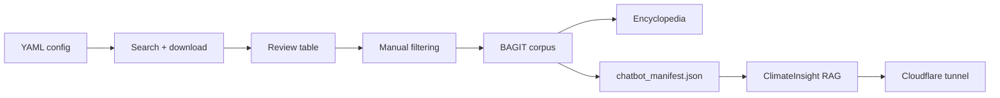

# Proposal: semantic_corpus end-to-end demo — ocean currents & marine heatwaves

**Date:** 2026-07-16 (system date of generation)  
**Status:** Approved for P0; P1–P4 pending  
**Audience:** Team demo, documentation, and potential manuscript / outreach material

---

## 1. Purpose

Show the **full range** of semantic_corpus in one coherent story:

| Stage | What it demonstrates |
|-------|----------------------|
| Query | Reproducible literature search from YAML config |
| Download | Europe PMC harvest (50 papers, XML + PDF) |
| Review | Human curation in the interactive HTML review table |
| Encyclopedia | Domain vocabulary + curated concept pages from the corpus |
| RAG export | Structured handoff for LLM retrieval |
| Cloudflare chatbot | Public demo via ClimateInsight + Quick Tunnels |

The demo topic **ocean currents and heatwaves** is scientifically coherent, climate-relevant (aligns with style-guide conventions), and distinct from existing corpora (`climate_anxiety_2026`, `climate_change_2026`, `aqi_india_pilot`).

---

## 2. Recommended demo corpus

**Name:** `ocean_heatwaves_2026`  
**Config:** [config/ocean_heatwaves_2026.yaml](../../config/ocean_heatwaves_2026.yaml)

**Query (Europe PMC):**

```text
("marine heatwave" OR "ocean heat wave" OR "ocean heatwave")
AND ("ocean current" OR "ocean circulation" OR "Gulf Stream" OR "AMOC")
AND (HAS_FT:Y)
```

**Parameters:**

| Field | Value |
|-------|-------|
| `repository` | `europe_pmc` |
| `limit` | `50` |
| `formats` | `xml`, `pdf` |
| `start_date` | `2020-01-01` |
| `end_date` | `2026-12-31` |
| `corpus_name` | `ocean_heatwaves_2026` |
| `output_subdir` | `ocean_heatwaves_2026` |

**Why a fresh corpus, not reuse `climate_anxiety_2026`?**

- The narrative matches the demo topic exactly.
- Avoids conflating “climate anxiety” with “ocean physics”.
- Shows the pipeline is **repeatable**, not a one-off tutorial artefact.

**Fallback for dry runs:** If live API/download fails during a demo rehearsal, use `climate_anxiety_2026` as a **known-good** review-table backup (50 papers, full downloads, editable HTML at `temp/queries/climate_anxiety_2026/review/`).

---

## 3. End-to-end pipeline (seven acts)



### Act 1 — Issue query

**Tooling:** `scripts/build_example_corpus.py` or `run_pilot_from_config()`  
**Artefacts:** `temp/queries/ocean_heatwaves_2026/query_run.json`, `search_results.json`, downloads

### Act 2 — Download 50 papers

**Tooling:** Europe PMC repository + `download_completeness` check  
**Success criteria:** 50 retrieved; XML/PDF rates logged honestly

### Act 3 — Build review table

**Tooling:** `scripts/build_review_table.py`  
**Artefacts:** `review/review_table.{json,html,csv,md}`

### Act 4 — Manual filtering

**Tooling:** `scripts/review_viewer.py serve` over HTTP  
**Targets:** ~25–35 `include`, ~10–15 `exclude`, remainder `review`

### Act 5 — Ingest to BAGIT corpus

**Tooling:** `ingest_and_review_pygetpapers` / `build_example_corpus.py`  
**Output:** `corpora/ocean_heatwaves_2026/`

### Act 6 — Build encyclopedia

**Tooling (sibling repo):** `../encyclopedia` — phase1 wordlist + encyclopedia_builder  
**Gap:** Thin glue script from BAGIT corpus (P2)

### Act 7 — RAG + Cloudflare chatbot

**Export:** `chatbot_manifest.json` via `export_reviewed_corpus_for_chatbot`  
**Ingest:** ClimateInsight (manifest adapter — P3)  
**Share:** `ClimateInsight/scripts/inject-tunnel.py` (Cloudflare Quick Tunnels)

See [ocean_heatwaves_demo.md](ocean_heatwaves_demo.md) for step-by-step commands.

---

## 4. What exists vs what we need to build

| Capability | Status | Notes |
|------------|--------|-------|
| YAML query config | ✅ P0 | `config/ocean_heatwaves_2026.yaml` |
| Europe PMC search + download | ✅ | `workflow.run_repository_search` |
| Download completeness check | ✅ | Hard check + PRISMA integration |
| Review table build + HTML editor | ✅ | Tutorials in `docs/tutorials/` |
| BAGIT ingest | ✅ | `pygetpapers_ingester` |
| PRISMA diagram | ✅ | Optional demo flourish |
| `chatbot_manifest.json` export | ✅ | `chatbot_export.py` |
| Encyclopedia from corpus | ⚠️ Partial | Logic in `../encyclopedia`; glue script needed (P2) |
| ClimateInsight manifest ingest | ✅ | Adapter in ClimateInsight (P3, 2026-07-16) |
| Cloudflare tunnel | ✅ | In ClimateInsight repo |
| Demo runbook | ✅ P0 | `docs/demo/ocean_heatwaves_demo.md` |

---

## 5. Proposed deliverables

1. **`docs/demo/ocean_heatwaves_demo.md`** — step-by-step runbook (P0)
2. **`config/ocean_heatwaves_2026.yaml`** — query spec (P0)
3. **Pre-run corpus snapshot** — optional; git-ignored under `corpora/` (P1)
4. **`temp/exports/ocean_heatwaves_2026/chatbot_manifest.json`** — RAG handoff (P1)
5. **`corpora/ocean_heatwaves_2026/encyclopedia/`** — sample encyclopedia (P2)
6. **PRISMA SVG** — optional figure (P1)
7. **ClimateInsight branch or PR** — manifest ingest (P3)
8. **Screencast script** — optional (P4)

---

## 6. Demo formats

### A. Live workshop (~60–90 min)

Run query + download (or show pre-run), team reviews live, ingest + export, show encyclopedia, launch Cloudflare chatbot.

### B. Conference / webinar (~20 min)

Pre-run everything; live segments: review table save + chatbot Q&A only.

### C. Self-serve tutorial

Appendix to workflow docs or standalone runbook (this proposal uses a separate `docs/demo/` runbook).

---

## 7. Risks and mitigations

| Risk | Mitigation |
|------|------------|
| Off-topic papers | Tighten query; show exclude decisions live |
| Incomplete downloads | Pre-run; download completeness banner |
| Live review too slow | Pre-seed statuses; live-edit 3 rows only |
| Encyclopedia slow | Pre-build; demo shows output + architecture |
| ClimateInsight ingest not ready | Pre-indexed ChromaDB or HTML bundle for demo day |
| LLM provider confusion | Align ClimateInsight config before demo |
| Large artefacts in git | Keep downloads in `temp/`; optional release tarball |

---

## 8. Implementation phases

| Phase | Scope | Repo | Status |
|-------|-------|------|--------|
| **P0** | Query config + runbook doc | semantic_corpus | ✅ |
| **P1** | Harvest + review + ingest + export | semantic_corpus | ✅ 2026-07-16 |
| **P2** | Encyclopedia glue + sample output | semantic_corpus + encyclopedia | Pending |
| **P3** | ClimateInsight manifest ingest | ClimateInsight | ✅ 2026-07-16 |
| **P4** | Rehearsal + Cloudflare dry run | both | **Next** |

---

## 9. Decisions still open

1. **Query string and date range** — default in config uses 2020–2026; tighten to 2024+ if needed.
2. **Encyclopedia scope** — ~20 pilot terms vs ~100 full.
3. **ClimateInsight ingest** — Option A (manifest module), B (HTML bundle), or C (pre-built demo + manifest shown separately).
4. **LLM for demo** — Ollama local vs Gemini.
5. **Demo format** — workshop, webinar, or self-serve.
6. **Git policy for corpus** — commit, release asset, or local only.

---

## Related docs

- [README.md](README.md) — demo doc index
- [ocean_heatwaves_demo.md](ocean_heatwaves_demo.md) — runbook
- [ocean_heatwaves_progress.md](ocean_heatwaves_progress.md) — **incremental progress log**
- [../records/2026-07-16_ocean_heatwaves_demo.md](../records/2026-07-16_ocean_heatwaves_demo.md) — dated record
- [../summary/2026-07-16_ocean_heatwaves_demo.md](../summary/2026-07-16_ocean_heatwaves_demo.md) — session summary
- [chatbot_export_contract.md](../chatbot_export_contract.md)
- [orat_plan.md](../orat_plan.md)
- [html_review_table_tutorial.md](../tutorials/html_review_table_tutorial.md)
- [prisma_flow.md](../prisma_flow.md)

## Implementation notes (recorded 2026-07-16)

- Search path is **semantic_corpus Europe PMC**, not pygetpapers.
- First PDF pass failed (0 PDFs); after `europe_pmc.py` fix + re-run: **10 PDFs**.
- Europe PMC `pdf=render` largely unavailable (404) on 2026-07-16; publisher URLs used where present.
- BAGIT nesting (`data/data/`) and empty chatbot export until includes + path fix — tracked in progress log.
