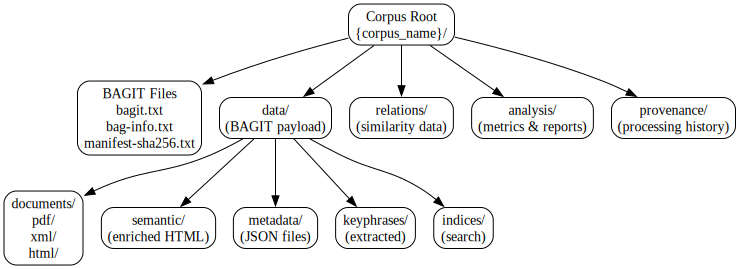
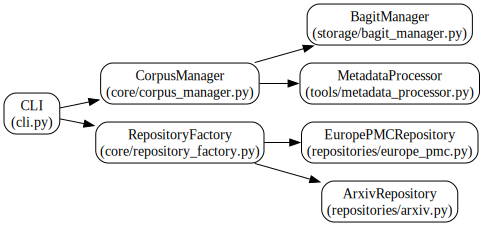
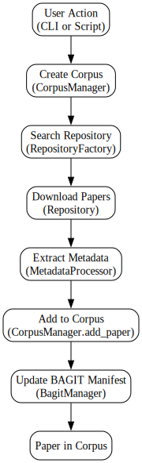
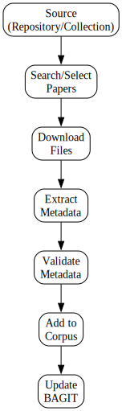
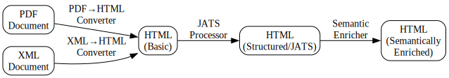
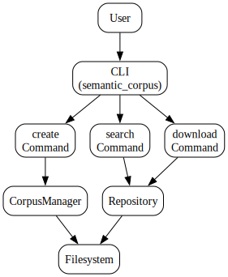
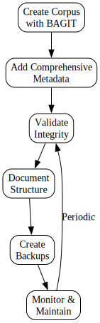

# SemanticCorpus: Overview for Newcomers

**Date:** December 18, 2025  
**Version:** 0.1.0a1  
**Status:** Active Development

---

## Table of Contents

1. [Introduction](#introduction)
2. [Corpus Structure](#corpus-structure)
3. [Corpus Manager Software System](#corpus-manager-software-system)
4. [Ingestion Examples](#ingestion-examples)
5. [Retrieval Examples](#retrieval-examples)
6. [Document Transformation Workflow](#document-transformation-workflow)
7. [CLI and Scripts Usage](#cli-and-scripts-usage)
8. [Preservation and Future-Proofing](#preservation-and-future-proofing)
9. [Additional Topics](#additional-topics)

---

## Introduction

**SemanticCorpus** is a lightweight, filesystem-based system for creating and managing personal scientific research corpora. It is designed for:

- **Personal and group research**: Manage collections of scientific papers locally
- **Semantic enrichment**: Extract keyphrases, compute document similarities, and build knowledge graphs
- **Standards compliance**: Uses BAGIT (BagIt File Packaging Format) for preservation-ready storage
- **Lightweight operation**: Filesystem-based storage, no database required

### Key Features

- ✅ Document ingestion from repositories (Europe PMC, arXiv)
- ✅ BAGIT-compliant storage for preservation
- ✅ Metadata extraction and processing
- ✅ Document transformation (PDF/XML → HTML)
- ✅ Semantic enrichment (planned)
- ✅ Similarity analysis and knowledge graphs (planned)

---

## Corpus Structure

### BAGIT-Compliant Structure (Recommended)

When creating a corpus with `use_bagit=True`, SemanticCorpus creates a BAGIT-compliant structure:

```
{corpus_name}/
├── bagit.txt                    # BAGIT version specification
├── bag-info.txt                 # Bag metadata (organization, contact, etc.)
├── manifest-sha256.txt          # File checksums (SHA256)
├── tagmanifest-sha256.txt       # Tag file checksums
│
├── data/                        # BAGIT payload directory (all content here)
│   ├── documents/               # Original documents
│   │   ├── pdf/                 # PDF files
│   │   ├── xml/                 # XML files
│   │   └── html/                # HTML files
│   ├── semantic/                # Semantically enriched HTML
│   ├── metadata/                 # Document metadata (JSON)
│   │   └── {paper_id}_metadata.json
│   ├── keyphrases/              # Extracted keyphrases (planned)
│   └── indices/                 # Search indices (planned)
│
├── relations/                   # Document relationships (outside data/)
│   ├── similarity_matrix.json   # Document similarity scores
│   ├── similarity_graph.json    # Graph representation
│   └── related_documents.json   # Related document pairs
│
├── analysis/                    # Analysis outputs
│   ├── validation_report.json   # Quality validation results
│   ├── quality_metrics.json    # Corpus quality metrics
│   └── statistics.json          # Corpus statistics
│
└── provenance/                  # Processing history
    ├── ingestion_log.json       # Ingestion history
    └── processing_history.json  # Transformation history
```

**BAGIT Benefits:**
- ✅ Preservation-ready format (used by libraries and archives)
- ✅ Data integrity (checksums for all files)
- ✅ Metadata tracking (bag-info.txt)
- ✅ Standard format for sharing and archiving

### Legacy Structure (Backward Compatible)

For backward compatibility, corpora can be created without BAGIT:

```
{corpus_name}/
└── papers/
    └── {paper_id}/
        ├── metadata.json
        ├── {paper_id}.pdf
        └── {paper_id}.xml
```

### Directory Structure Diagram



*Figure 1: BAGIT-compliant corpus directory structure*

---

## Corpus Manager Software System

### Architecture Overview

The SemanticCorpus system follows a modular architecture:



*Figure 2: SemanticCorpus system architecture*

### Core Components

#### 1. CorpusManager (`semantic_corpus.core.corpus_manager`)

**Purpose**: Central manager for corpus operations.

**Key Methods**:
- `__init__(corpus_dir, use_bagit=False)`: Initialize corpus
- `add_paper(paper_id, metadata)`: Add paper to corpus
- `get_paper_metadata(paper_id)`: Retrieve paper metadata
- `list_papers()`: List all papers in corpus
- `search_papers(query, field="title")`: Search papers
- `get_statistics()`: Get corpus statistics
- `create_structured_directories()`: Create BAGIT structure

**Example**:
```python
from pathlib import Path
from semantic_corpus.core.corpus_manager import CorpusManager

# Create corpus with BAGIT support
corpus_dir = Path("corpora/my_research")
corpus = CorpusManager(corpus_dir, use_bagit=True)
corpus.create_structured_directories()

# Add a paper
metadata = {
    "title": "Climate Change Adaptation",
    "authors": ["Smith, J.", "Doe, A."],
    "doi": "10.1234/example",
    "publication_date": "2024-01-15"
}
corpus.add_paper("paper_001", metadata)

# Retrieve metadata
paper_meta = corpus.get_paper_metadata("paper_001")
print(paper_meta["title"])

# List all papers
papers = corpus.list_papers()
print(f"Corpus contains {len(papers)} papers")
```

#### 2. BagitManager (`semantic_corpus.storage.bagit_manager`)

**Purpose**: Manages BAGIT-compliant bag creation and validation.

**Key Methods**:
- `create_bag(metadata=None)`: Create BAGIT bag
- `validate_bag()`: Validate bag integrity
- `update_manifest()`: Update checksums after file changes
- `get_bag_info()`: Get bag metadata
- `create_structured_directories()`: Create corpus directory structure

**Example**:
```python
from pathlib import Path
from semantic_corpus.storage.bagit_manager import BagitManager

bag_dir = Path("corpora/my_research")
bagit_mgr = BagitManager(bag_dir)

# Create bag with metadata
metadata = {
    "Source-Organization": "My Research Lab",
    "Contact-Name": "Jane Doe",
    "Contact-Email": "jane@example.com"
}
bagit_mgr.create_bag(metadata=metadata)

# Validate bag
is_valid = bagit_mgr.validate_bag()
print(f"Bag is valid: {is_valid}")
```

#### 3. Repository System

**Purpose**: Abstract interface for paper repositories (Europe PMC, arXiv, etc.).

**Components**:
- `RepositoryInterface`: Abstract base class
- `RepositoryFactory`: Factory for creating repository instances
- `EuropePMCRepository`: Europe PMC implementation
- `ArxivRepository`: arXiv implementation

**Example**:
```python
from semantic_corpus.core.repository_factory import RepositoryFactory

# Get repository
repo = RepositoryFactory.get_repository("europe_pmc")

# Search papers
results = repo.search_papers(
    query="climate change adaptation",
    limit=10
)

# Download paper
download_result = repo.download_paper(
    paper_id="40964903",
    output_dir=Path("temp/downloads"),
    formats=["xml", "pdf"]
)
```

#### 4. Metadata Processing

**Purpose**: Extract, process, and normalize metadata from various sources.

**Components**:
- `MetadataExtractor`: Extract metadata from files
- `MetadataProcessor`: Process and normalize metadata
- `MetadataValidator`: Validate metadata completeness

**Example**:
```python
from pathlib import Path
from semantic_corpus.tools.metadata_processor import MetadataProcessor

processor = MetadataProcessor()

# Process PDF metadata
pdf_path = Path("temp/downloads/paper.pdf")
pdf_metadata = processor.process_pdf_metadata(pdf_path)

# Process XML metadata
xml_path = Path("temp/downloads/paper.xml")
xml_metadata = processor.process_xml_metadata(xml_path)

# Normalize metadata
normalized = processor.normalize_metadata(xml_metadata)
```

### System Flow Diagram



*Figure 3: End-to-end system workflow*

---

## Ingestion Examples

### Example 1: Ingest from Europe PMC (CLI)

**Step 1: Search for papers**
```bash
semantic_corpus search \
    --query "climate change adaptation" \
    --repository europe_pmc \
    --limit 10 \
    --output temp/downloads
```

**Step 2: Download papers**
```bash
semantic_corpus download \
    --query "climate change adaptation" \
    --repository europe_pmc \
    --limit 10 \
    --formats xml,pdf \
    --output temp/downloads
```

**Step 3: Create corpus and add papers (Python script)**
```python
from pathlib import Path
from semantic_corpus.core.corpus_manager import CorpusManager
from semantic_corpus.core.repository_factory import RepositoryFactory
from semantic_corpus.tools.metadata_processor import MetadataProcessor
import json

# Create corpus
corpus_dir = Path("corpora/climate_adaptation")
corpus = CorpusManager(corpus_dir, use_bagit=True)
corpus.create_structured_directories()

# Get repository
repo = RepositoryFactory.get_repository("europe_pmc")
processor = MetadataProcessor()

# Load search results
with open("temp/downloads/search_results.json") as f:
    search_results = json.load(f)

# Process each paper
for paper in search_results:
    paper_id = paper.get("pmcid") or paper.get("pmid")
    if not paper_id:
        continue
    
    # Download if not already downloaded
    download_dir = Path("temp/downloads")
    download_result = repo.download_paper(
        paper_id, download_dir, formats=["xml"]
    )
    
    # Extract metadata
    xml_file = download_dir / f"{paper_id}.xml"
    if xml_file.exists():
        metadata = processor.process_xml_metadata(xml_file)
        normalized = processor.normalize_metadata(metadata)
        
        # Add to corpus
        corpus_id = f"europe_pmc_{paper_id}"
        corpus.add_paper(corpus_id, normalized)
        
        # Copy file to corpus
        corpus_xml = Path(corpus_dir, "data", "documents", "xml", f"{corpus_id}.xml")
        corpus_xml.parent.mkdir(parents=True, exist_ok=True)
        corpus_xml.write_bytes(xml_file.read_bytes())
        
        print(f"Added {corpus_id} to corpus")
```

### Example 2: Ingest from pygetpapers Output

**Note**: pygetpapers ingestion module is planned for Phase 1.3. Here's the expected workflow:

```python
from pathlib import Path
from semantic_corpus.ingestion.pygetpapers_ingester import PygetpapersIngester
from semantic_corpus.core.corpus_manager import CorpusManager

# Initialize ingester
ingester = PygetpapersIngester()

# Point to pygetpapers output directory
pygetpapers_dir = Path("pygetpapers_output")

# Create corpus
corpus_dir = Path("corpora/from_pygetpapers")
corpus = CorpusManager(corpus_dir, use_bagit=True)
corpus.create_structured_directories()

# Ingest all papers
ingester.ingest(pygetpapers_dir, corpus)
```

### Example 3: Ingest from Existing Collection (IPCC)

**Note**: Collection ingester is planned for Phase 1.3. Expected usage:

```python
from pathlib import Path
from semantic_corpus.ingestion.collection_ingester import CollectionIngester
from semantic_corpus.core.corpus_manager import CorpusManager

# Initialize ingester
ingester = CollectionIngester()

# Point to collection directory
collection_dir = Path("ipcc_reports")

# Create corpus
corpus_dir = Path("corpora/ipcc")
corpus = CorpusManager(corpus_dir, use_bagit=True)
corpus.create_structured_directories()

# Ingest collection
ingester.ingest(collection_dir, corpus)
```

### Ingestion Workflow Diagram



*Figure 4: Document ingestion workflow*

---

## Retrieval Examples

### Example 1: List All Papers

```python
from pathlib import Path
from semantic_corpus.core.corpus_manager import CorpusManager

corpus_dir = Path("corpora/my_research")
corpus = CorpusManager(corpus_dir, use_bagit=True)

# List all papers
papers = corpus.list_papers()
print(f"Corpus contains {len(papers)} papers:")
for paper_id in papers:
    print(f"  - {paper_id}")
```

### Example 2: Retrieve Paper Metadata

```python
from pathlib import Path
from semantic_corpus.core.corpus_manager import CorpusManager
import json

corpus_dir = Path("corpora/my_research")
corpus = CorpusManager(corpus_dir, use_bagit=True)

# Get metadata for a specific paper
paper_id = "europe_pmc_40964903"
metadata = corpus.get_paper_metadata(paper_id)

print(f"Title: {metadata.get('title')}")
print(f"Authors: {', '.join(metadata.get('authors', []))}")
print(f"DOI: {metadata.get('doi')}")

# Pretty print full metadata
print(json.dumps(metadata, indent=2))
```

### Example 3: Search Papers

```python
from pathlib import Path
from semantic_corpus.core.corpus_manager import CorpusManager

corpus_dir = Path("corpora/my_research")
corpus = CorpusManager(corpus_dir, use_bagit=True)

# Search by title
results = corpus.search_papers("climate", field="title")
print(f"Found {len(results)} papers with 'climate' in title:")
for paper_id in results:
    metadata = corpus.get_paper_metadata(paper_id)
    print(f"  - {paper_id}: {metadata.get('title')}")

# Search by abstract
results = corpus.search_papers("adaptation", field="abstract")
print(f"\nFound {len(results)} papers with 'adaptation' in abstract")
```

### Example 4: Get Corpus Statistics

```python
from pathlib import Path
from semantic_corpus.core.corpus_manager import CorpusManager
import json

corpus_dir = Path("corpora/my_research")
corpus = CorpusManager(corpus_dir, use_bagit=True)

# Get statistics
stats = corpus.get_statistics()
print(json.dumps(stats, indent=2))

# Output:
# {
#   "total_papers": 25,
#   "corpus_size_mb": 45.6789,
#   "creation_date": "2025-12-18T10:30:00",
#   "last_updated": "2025-12-18T10:30:00"
# }
```

### Example 5: Access Document Files

```python
from pathlib import Path
from semantic_corpus.core.corpus_manager import CorpusManager

corpus_dir = Path("corpora/my_research")
corpus = CorpusManager(corpus_dir, use_bagit=True)

paper_id = "europe_pmc_40964903"

# Access files in BAGIT structure
xml_file = Path(corpus_dir, "data", "documents", "xml", f"{paper_id}.xml")
pdf_file = Path(corpus_dir, "data", "documents", "pdf", f"{paper_id}.pdf")
html_file = Path(corpus_dir, "data", "documents", "html", f"{paper_id}.html")

if xml_file.exists():
    print(f"XML file: {xml_file}")
    # Process XML file...

if pdf_file.exists():
    print(f"PDF file: {pdf_file}")
    # Process PDF file...
```

---

## Document Transformation Workflow

### Overview

Document transformation converts documents from their original formats (PDF, XML) into structured HTML suitable for semantic enrichment and analysis.

**Planned Workflow** (Phase 2):

```
PDF/XML → HTML → Structured HTML (JATS) → Semantically Enriched HTML
```

### Transformation Pipeline



*Figure 5: Document transformation pipeline*

### Step-by-Step Workflow

#### Step 1: PDF to HTML Conversion

**Planned Implementation** (Phase 2.1):
```python
from pathlib import Path
from semantic_corpus.transformation.pdf_to_html import PdfToHtmlConverter

converter = PdfToHtmlConverter()

# Convert PDF to HTML
pdf_path = Path("corpora/my_research/data/documents/pdf/paper_001.pdf")
html_path = Path("corpora/my_research/data/documents/html/paper_001.html")

converter.convert(pdf_path, html_path)
```

#### Step 2: XML to HTML Conversion

**Planned Implementation** (Phase 2.1):
```python
from pathlib import Path
from semantic_corpus.transformation.xml_to_html import XmlToHtmlConverter

converter = XmlToHtmlConverter()

# Convert XML to HTML
xml_path = Path("corpora/my_research/data/documents/xml/paper_001.xml")
html_path = Path("corpora/my_research/data/documents/html/paper_001.html")

converter.convert(xml_path, html_path)
```

#### Step 3: JATS Structuring

**Planned Implementation** (Phase 2.2):
```python
from pathlib import Path
from semantic_corpus.transformation.jats_processor import JatsProcessor

processor = JatsProcessor()

# Structure HTML using JATS
html_path = Path("corpora/my_research/data/documents/html/paper_001.html")
structured_html = Path("corpora/my_research/data/semantic/paper_001.html")

processor.structure(html_path, structured_html)
```

#### Step 4: Semantic Enrichment

**Planned Implementation** (Phase 3):
```python
from pathlib import Path
from semantic_corpus.semantification.annotation_adder import AnnotationAdder

enricher = AnnotationAdder()

# Add semantic annotations
structured_html = Path("corpora/my_research/data/semantic/paper_001.html")
enriched_html = Path("corpora/my_research/data/semantic/paper_001_enriched.html")

enricher.add_annotations(structured_html, enriched_html)
```

### Complete Transformation Example (Planned)

```python
from pathlib import Path
from semantic_corpus.core.corpus_manager import CorpusManager
from semantic_corpus.transformation.pdf_to_html import PdfToHtmlConverter
from semantic_corpus.transformation.jats_processor import JatsProcessor

corpus_dir = Path("corpora/my_research")
corpus = CorpusManager(corpus_dir, use_bagit=True)

# Get all papers
papers = corpus.list_papers()

# Transform each paper
for paper_id in papers:
    # PDF to HTML
    pdf_path = Path(corpus_dir, "data", "documents", "pdf", f"{paper_id}.pdf")
    html_path = Path(corpus_dir, "data", "documents", "html", f"{paper_id}.html")
    
    if pdf_path.exists():
        converter = PdfToHtmlConverter()
        converter.convert(pdf_path, html_path)
    
    # JATS structuring
    if html_path.exists():
        structured_html = Path(corpus_dir, "data", "semantic", f"{paper_id}.html")
        processor = JatsProcessor()
        processor.structure(html_path, structured_html)
    
    print(f"Transformed {paper_id}")
```

---

## CLI and Scripts Usage

### Command-Line Interface

The SemanticCorpus CLI provides commands for common operations:

#### Available Commands

```bash
semantic_corpus --help
```

**Output:**
```
usage: semantic_corpus [-h] [--config CONFIG] [--verbose] {create,search,download} ...

Semantic Corpus - Creation and management of personal scientific corpora

positional arguments:
  {create,search,download}
    create              Create a new corpus
    search              Search for papers in repositories
    download            Download papers from repositories

optional arguments:
  -h, --help            show this help message and exit
  --config CONFIG, -c CONFIG
                        Configuration file path
  --verbose, -v         Enable verbose output
```

#### Command 1: Create Corpus

```bash
semantic_corpus create \
    --name my_research \
    --path corpora
```

**Options:**
- `--name, -n`: Corpus name (required)
- `--path, -p`: Corpus directory path (default: `temp/corpus/{name}`)
- `--verbose, -v`: Enable verbose output

**Example Output:**
```
Corpus 'my_research' created successfully at corpora/my_research
```

#### Command 2: Search Papers

```bash
semantic_corpus search \
    --query "climate change adaptation" \
    --repository europe_pmc \
    --limit 10 \
    --output temp/downloads
```

**Options:**
- `--query, -q`: Search query (required)
- `--repository, -r`: Repository name (default: `europe_pmc`)
- `--limit, -l`: Maximum number of results (default: 10)
- `--output, -o`: Output directory (default: `temp/downloads`)
- `--verbose, -v`: Enable verbose output

**Example Output:**
```
Found 10 papers
1. Climate Change Adaptation Strategies
2. Adaptation to Climate Change in Agriculture
...
Results saved to temp/downloads/search_results.json
```

#### Command 3: Download Papers

```bash
semantic_corpus download \
    --query "climate change adaptation" \
    --repository europe_pmc \
    --limit 10 \
    --formats xml,pdf \
    --output temp/downloads
```

**Options:**
- `--query, -q`: Search query (required)
- `--repository, -r`: Repository name (default: `europe_pmc`)
- `--limit, -l`: Maximum number of results (default: 10)
- `--formats, -f`: File formats to download (default: `xml,pdf`)
- `--output, -o`: Output directory (default: `temp/downloads`)
- `--verbose, -v`: Enable verbose output

**Example Output:**
```
Found 10 papers, starting download...
Downloaded 40964903
Downloaded 40964904
...
Downloaded 10 papers to temp/downloads
```

### Configuration Files

You can use YAML configuration files to simplify command-line usage:

**config.yaml:**
```yaml
query: "climate change adaptation"
repository: europe_pmc
limit: 20
formats:
  - xml
  - pdf
output: temp/downloads
```

**Usage:**
```bash
semantic_corpus download --config config.yaml
```

### Python Scripts

For more complex workflows, use Python scripts:

**Example Script: `ingest_papers.py`**
```python
#!/usr/bin/env python3
"""Script to ingest papers from Europe PMC into a corpus."""

from pathlib import Path
from semantic_corpus.core.corpus_manager import CorpusManager
from semantic_corpus.core.repository_factory import RepositoryFactory
from semantic_corpus.tools.metadata_processor import MetadataProcessor
import json

def main():
    # Configuration
    corpus_name = "climate_adaptation"
    query = "climate change adaptation"
    limit = 20
    
    # Create corpus
    corpus_dir = Path("corpora", corpus_name)
    corpus = CorpusManager(corpus_dir, use_bagit=True)
    corpus.create_structured_directories()
    print(f"Created corpus: {corpus_dir}")
    
    # Get repository
    repo = RepositoryFactory.get_repository("europe_pmc")
    processor = MetadataProcessor()
    
    # Search and download
    print(f"Searching for: {query}")
    results = repo.search_papers(query=query, limit=limit)
    print(f"Found {len(results)} papers")
    
    # Process each paper
    download_dir = Path("temp", "downloads")
    download_dir.mkdir(parents=True, exist_ok=True)
    
    for i, paper in enumerate(results, 1):
        paper_id = paper.get("pmcid") or paper.get("pmid")
        if not paper_id:
            continue
        
        print(f"[{i}/{len(results)}] Processing {paper_id}...")
        
        try:
            # Download
            download_result = repo.download_paper(
                paper_id, download_dir, formats=["xml"]
            )
            
            if not download_result["success"]:
                print(f"  Failed to download {paper_id}")
                continue
            
            # Extract metadata
            xml_file = download_dir / f"{paper_id}.xml"
            if xml_file.exists():
                metadata = processor.process_xml_metadata(xml_file)
                normalized = processor.normalize_metadata(metadata)
                
                # Add to corpus
                corpus_id = f"europe_pmc_{paper_id}"
                corpus.add_paper(corpus_id, normalized)
                
                # Copy file to corpus
                corpus_xml = Path(
                    corpus_dir, "data", "documents", "xml", f"{corpus_id}.xml"
                )
                corpus_xml.parent.mkdir(parents=True, exist_ok=True)
                corpus_xml.write_bytes(xml_file.read_bytes())
                
                print(f"  Added {corpus_id}")
        
        except Exception as e:
            print(f"  Error processing {paper_id}: {e}")
    
    # Print statistics
    stats = corpus.get_statistics()
    print(f"\nCorpus statistics:")
    print(f"  Total papers: {stats['total_papers']}")
    print(f"  Size: {stats['corpus_size_mb']:.2f} MB")

if __name__ == "__main__":
    main()
```

**Run script:**
```bash
python ingest_papers.py
```

### CLI Workflow Diagram



*Figure 6: Command-line interface workflow*

---

## Preservation and Future-Proofing

### Does BAGIT Provide Future-Proofing?

**Yes, BAGIT provides significant future-proofing benefits**, though comprehensive preservation requires additional practices. This section explains what BAGIT offers and what else you should consider.

### What BAGIT Provides

#### 1. **Data Integrity Protection**

BAGIT ensures your documents remain intact over time:

- **Checksums**: Every file has a SHA256/SHA512 checksum in the manifest
- **Validation**: You can verify file integrity at any time
- **Corruption Detection**: Automatic detection of file corruption or tampering

**Example:**
```python
from semantic_corpus.storage.bagit_manager import BagitManager
from pathlib import Path

corpus_dir = Path("corpora/my_research")
bagit_mgr = BagitManager(corpus_dir)

# Validate bag integrity
is_valid = bagit_mgr.validate_bag()
if not is_valid:
    print("WARNING: Bag integrity check failed!")
```

#### 2. **Standards Compliance**

- **RFC 8493**: BAGIT is an IETF standard (Internet Engineering Task Force)
- **Wide Adoption**: Used by libraries, archives, and digital preservation institutions worldwide
- **Tool Ecosystem**: Multiple tools and libraries support BAGIT across platforms
- **Future Compatibility**: Standards-based formats are more likely to remain readable

#### 3. **Metadata Preservation**

BAGIT preserves important context about your corpus:

- **Provenance**: Who created the corpus and when
- **Contact Information**: How to reach the creators
- **Description**: What the corpus contains
- **Custom Fields**: Any additional metadata you need

**Example:**
```python
# Create bag with comprehensive metadata
metadata = {
    "Source-Organization": "My Research Lab",
    "Contact-Name": "Jane Doe",
    "Contact-Email": "jane@example.com",
    "Bagging-Date": "2025-12-18",
    "External-Description": "Climate adaptation research corpus",
    "External-Identifier": "corpus-2025-001"
}
bagit_mgr.create_bag(metadata=metadata)
```

#### 4. **Transfer Reliability**

BAGIT was designed for reliable data transfer:

- **Self-Contained**: All metadata travels with the data
- **Verifiable**: Recipients can verify integrity immediately
- **Platform Independent**: Works across operating systems and storage systems

#### 5. **Format Independence**

- **Any File Types**: BAGIT works with PDF, XML, HTML, images, or any file format
- **No Format Lock-in**: You're not tied to proprietary formats
- **Migration Friendly**: Easy to migrate to new storage systems or formats

### Limitations and Additional Considerations

While BAGIT provides excellent foundation, comprehensive future-proofing requires:

#### 1. **File Format Sustainability**

**Challenge**: BAGIT protects file integrity, but doesn't guarantee file formats will remain readable.

**Solution**:
- Use open, well-documented formats (PDF, XML, HTML)
- Keep original formats when possible
- Plan for format migration if needed
- Document your format choices

**Example Strategy**:
```
data/documents/
├── pdf/          # Original PDFs (preserve)
├── xml/          # Original XML (preserve)
└── html/         # Converted HTML (for processing)
```

#### 2. **Regular Maintenance**

**Required Actions**:
- **Periodic Validation**: Regularly validate bag integrity
- **Media Refresh**: Migrate to new storage media periodically
- **Checksum Verification**: Verify checksums after any transfer

**Maintenance Script Example**:
```python
from pathlib import Path
from semantic_corpus.storage.bagit_manager import BagitManager
import json
from datetime import datetime

def validate_corpus(corpus_dir: Path):
    """Validate corpus integrity and generate report."""
    bagit_mgr = BagitManager(corpus_dir)
    
    is_valid = bagit_mgr.validate_bag()
    bag_info = bagit_mgr.get_bag_info()
    
    report = {
        "validation_date": datetime.now().isoformat(),
        "corpus_path": str(corpus_dir),
        "is_valid": is_valid,
        "bag_info": bag_info
    }
    
    report_path = Path(corpus_dir, "analysis", "validation_report.json")
    report_path.parent.mkdir(parents=True, exist_ok=True)
    
    with open(report_path, 'w') as f:
        json.dump(report, f, indent=2)
    
    return is_valid

# Run validation
corpus_dir = Path("corpora/my_research")
if validate_corpus(corpus_dir):
    print("Corpus validation passed")
else:
    print("WARNING: Corpus validation failed")
```

#### 3. **Documentation**

**Essential Documentation**:
- **Structure Documentation**: Document your directory structure
- **Processing Workflows**: Record how documents were processed
- **Metadata Schemas**: Document what metadata fields mean
- **Format Decisions**: Explain why you chose certain formats

**Example Documentation File**:
```markdown
# Corpus Documentation: climate_adaptation

## Structure
- `data/documents/pdf/`: Original PDF files
- `data/documents/xml/`: Original XML files
- `data/metadata/`: JSON metadata files
- `data/semantic/`: Semantically enriched HTML

## Processing
1. Downloaded from Europe PMC
2. Extracted metadata using MetadataProcessor
3. Stored in BAGIT-compliant structure

## Formats
- PDF: Original format, preserved
- XML: Original format, preserved
- HTML: Generated for semantic processing
```

#### 4. **Multiple Copies**

**Best Practice**: Store multiple copies in different locations.

- **Primary Copy**: Your working corpus
- **Backup Copy**: Regular backups
- **Archive Copy**: Long-term storage (different location/media)

**BAGIT Advantage**: BAGIT makes it easy to verify copies are identical:
```python
# Verify two bags are identical
bag1 = BagitManager(Path("corpora/primary"))
bag2 = BagitManager(Path("backups/backup"))

if bag1.validate_bag() and bag2.validate_bag():
    # Compare manifests to verify they're identical
    print("Both bags are valid and can be compared")
```

### Preservation Best Practices for SemanticCorpus

#### 1. **Always Use BAGIT for New Corpora**

```python
# Create corpus with BAGIT
corpus = CorpusManager(corpus_dir, use_bagit=True)
corpus.create_structured_directories()
```

#### 2. **Add Comprehensive Metadata**

```python
metadata = {
    "Source-Organization": "Your Organization",
    "Contact-Name": "Your Name",
    "Contact-Email": "your@email.com",
    "Bagging-Date": datetime.now().strftime("%Y-%m-%d"),
    "External-Description": "Description of corpus contents",
    "External-Identifier": "Unique identifier for this corpus"
}
bagit_mgr.create_bag(metadata=metadata)
```

#### 3. **Regular Validation Schedule**

- **Monthly**: Quick validation checks
- **Quarterly**: Full integrity validation
- **After Transfers**: Always validate after copying/moving
- **Before Archiving**: Validate before long-term storage

#### 4. **Document Your Corpus**

- Create a `README.md` in your corpus directory
- Document the structure and contents
- Record processing workflows
- Note any special considerations

#### 5. **Plan for Format Migration**

- Monitor format obsolescence
- Keep original formats when possible
- Plan migration strategies for at-risk formats
- Test format readability periodically

#### 6. **Maintain Multiple Copies**

- Regular backups
- Off-site storage
- Different storage media (disk, cloud, tape)
- Verify copies are identical using BAGIT validation

### Preservation Workflow Diagram



*Figure 7: Preservation and maintenance workflow*

### Summary

**BAGIT provides strong future-proofing for**:
- ✅ Data integrity (checksums, validation)
- ✅ Standards compliance (RFC 8493)
- ✅ Transfer reliability
- ✅ Metadata preservation
- ✅ Format independence

**Additional practices needed**:
- ⚠️ File format sustainability planning
- ⚠️ Regular maintenance and validation
- ⚠️ Comprehensive documentation
- ⚠️ Multiple copies and backups
- ⚠️ Format migration planning

**For SemanticCorpus**: BAGIT provides an excellent foundation for preservation. Combined with good documentation, regular validation, and format migration planning, your corpora will be well-protected for the long term.

---

## Additional Topics

### What's Missing from This Overview?

Based on the development plan, here are additional topics that will be covered as features are implemented:

#### 1. **Keyphrase Extraction** (Phase 2.3)
- KeyBERT integration
- YAKE integration
- TF-IDF extraction
- Keyphrase indexing and search

#### 2. **Similarity Analysis** (Phase 2.4)
- Text similarity computation
- Similarity matrix generation
- Feature extraction methods
- Similarity graph construction

#### 3. **Knowledge Graph** (Phase 2.5)
- Graph building from similarities
- Interdocument link creation
- Graph visualization
- Graph querying

#### 4. **DataTables Display** (Phase 2.6)
- HTML table generation
- Interactive DataTables.js integration
- Search and filtering
- Export functionality

#### 5. **Validation and Quality** (Phase 2.7)
- Conversion validation
- Metadata validation
- Quality metrics
- Reporting

#### 6. **Advanced Ingestion** (Phase 1.3)
- pygetpapers integration
- Collection ingester (IPCC, etc.)
- Batch processing
- Error handling and retry logic

### Recommended Reading

1. **Development Plan**: `docs/development_plan.md` - Complete development roadmap
2. **Phase 1 Summary**: `docs/phase1_implementation_summary.md` - BAGIT implementation details
3. **Testing Guide**: `TESTING.md` - Test structure and conventions
4. **Style Guide**: `../amilib/docs/style_guide_compliance.md` - Coding standards

### Getting Help

- **Issues**: https://github.com/semanticClimate/semantic_corpus/issues
- **Documentation**: `docs/` directory
- **Code Examples**: `tests/` directory

### Next Steps for Newcomers

1. **Install Dependencies**:
   ```bash
   pip install -e .
   ```

2. **Run Tests**:
   ```bash
   python -m pytest tests/
   ```

3. **Create Your First Corpus**:
   ```bash
   semantic_corpus create --name my_first_corpus
   ```

4. **Try the Examples**: Use the examples in this document to get started

5. **Explore the Code**: Read the source code in `semantic_corpus/` to understand the implementation

---

**Document Version**: 1.0  
**Last Updated**: December 18, 2025  
**Maintainer**: Semantic Climate Team

